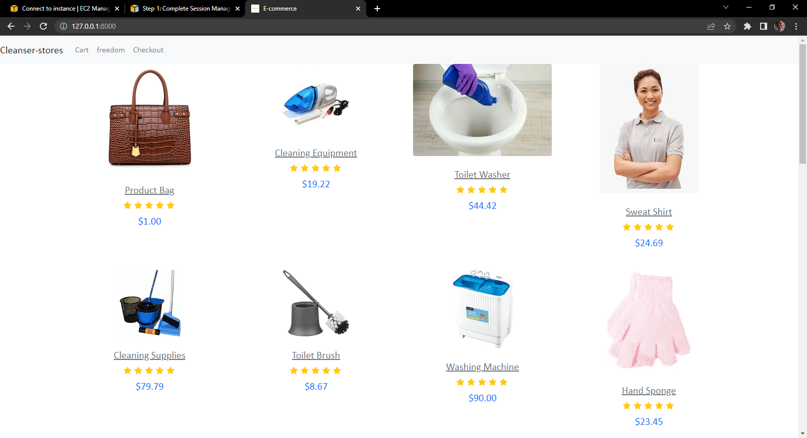

<h1>Cleanser Stores</h1>


<p>A shopping platform for an imaginary store for cleaning agents</p>

## Features Included
<ul>
    <li>Shopping Cart</li>
    <li>Payments using PayPal</li>
    <li>Responsive, mobile-friendly design</li>
    </ul>

## Requirements
<h3><a href = "https://developer.paypal.com/tools/sandbox/accounts/" >A paypal dev account</a> (You won't be charged)</h3>

## Installation

**1.Clone Repository $ Install Packages**
```sh
git clone https:github.com/freedompraise/cleanser-stores.git
pip install -r requirements.txt
```
**2.Setup Virtualenv**
```sh
virtualenv env
source env/bin/activate
```
**3.Migrate $ Start Server**
```sh
python manage.py makemigrations
python manage.py migrate
python manage.py runserver
```

## How to reach me
Follow me on [Twitter](https://twitter.com/freedom_praise)
Connect with me on [Linkedin](https://linkedin.com/praise-dike-7a25011b3)

## License
Apache License 2.0

<h4>Copyright 2022 Praise Freedom Dike</h4>

Licensed under the Apache License, Version 2.0 (the "License");
you may not use this file except in compliance with the License.
You may obtain a copy of the License at

    http://www.apache.org/licenses/LICENSE-2.0

Unless required by applicable law or agreed to in writing, software
distributed under the License is distributed on an "AS IS" BASIS,
WITHOUT WARRANTIES OR CONDITIONS OF ANY KIND, either express or implied.
See the License for the specific language governing permissions and
limitations under the License.
